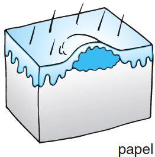

14 Hud
******

:date: 2018-05-01 12:45
:category: Kapitler

* **Link to machine translation of this page to english:** `Google Translate <https://translate.google.com/translate?sl=da&hl=en&u=http://wiki.hoer-laegedansk.dk/14_Hud>`__
* **Oplæsning for hele kapitlet:** <html5media>File:HELE14.mp3</html5media>

**Nøglepunkter**

<html5media>File:KAP14_194.mp3</html5media>

* Hudforandringer kan ses ved både primære hudlidelser og ved
  sygdom i andre organsystemer.
* Det er vigtigt at være systematisk og præcis i sin beskrivelse af
  hudforandringer; ofte må man senere konferere med lærebøger
  eller hudlæger for at stille diagnosen.
  
Symptomer
=========

<html5media>File:KAP14_194_2.mp3</html5media>

De vigtigste symptomer ved hudlidelser er kløe, udslæt og sår.

Kløe (pruritus)
---------------

<html5media>File:KAP14_194_3.mp3</html5media>

Ofte skyldes kløe en lokal hudpåvirkning, som udløser irritation eller
allergisk reaktion i huden, f.eks. myggestik eller rengøringsmidler. Fokuser
på evt. udløsende faktorer.

**Kløe**

<html5media>File:BOKS194.mp3</html5media>

* Kendte allergier?
* Udsat for rengøringsmidler, kemikalier osv.?
* Insektbid?
* Medicinindtagelse?

Flere systemiske sygdomme kan give kløe, f.eks. icterus, diabetes, lymfom
og uræmi. Kløe ses ved universelle allergiske reaktioner (f.eks. penicillinallergi),
men er også en hyppig bivirkning til flere lægemidler (f.eks. morfin) uden at der er tale om allergi.

Udslæt (exanthema)
------------------

<html5media>File:KAP14_195.mp3</html5media>

Enhver synlig hudforandring benævnes et udslæt eller *eksantem*. Udslæt
er ofte ledsaget af andre symptomer som kløe, hævelse eller feber. Anamneseoptagelsen
fokuserer på at skelne mellem akut opståede og kroniske
udslæt og at afsløre evt. udløsende faktorer.

**Udslæt**

<html5media>File:BOKS195.mp3</html5media>

* Opstået pludseligt?
* Konstant, eller har det bredt sig?
* Kløe?
* Har der været blærer?
* Lysfølsomt?
* Feber eller ledsymptomer?

Udslæt er kardinalsymptomet ved primære hudlidelser som f.eks. *psoriasis*
eller atopisk dermatit. Udslæt kan skyldes infektioner i huden med
f.eks. svamp eller stafylokokker. Karakteristiske hudforandringer ses ved
flere akutte og kroniske sygdomme (f.eks. petekkier ved meningokoksepsis).

Sår (ulcus)
-----------

<html5media>File:KAP14_195_2.mp3</html5media>

Sår er ofte følger efter traumer, men kan også være sekundære til systemiske
lidelser som diabetes og aterosklerose. Anamneseoptagelsen fokuserer
på at erkende disse disponerende faktorer.

Objektiv undersøgelse	
=====================

<html5media>File:KAP14_195_3.mp3</html5media>

Den objektive undersøgelse af huden kræver få hjælpemidler. Undersøg
altid patienten afklædt – slå dig ikke til tåls med, at der bliver løftet lidt
på et bukseben for at fremvise en plet. Sørg for god belysning, og vær
opmærksom på belysningskildens virkning: Den patient, der i det dunkle
lys fra sengebordslampen virker ikterisk, kan vise sig at have dansk
normalfarve ved iagttagelse i dagslys.

Inspektion og palpation
-----------------------

<html5media>File:KAP14_196.mp3</html5media>

Ved undersøgelse af huden suppleres iagttagelsen med palpation af det
sete. Det er vigtigt at være systematisk og præcis i sin beskrivelse af hudforandringer;
ofte må man senere konferere med lærebøger eller hudlæger
for at stille diagnosen.Man indleder med at beskrive *udbredelsen* af
hudforandringerne. Er der tale om universelle forandringer (f.eks. icterus)
eller lokaliserede evt. symmetriske forandringer? Herefter beskrives
hudforandringernes *farve* og *konsistens*, evt. med anvendelse af de dermatologiske
termer for karakteristiske hudforandringer.

**Hudens konsistens**

<html5media>File:BOKS196A.mp3</html5media>

*Normal:*
  - blød og elastisk
*Infiltreret:*
  - fast og fortykket
*Indureret:*
  - hård.
  
**Hudforandringer**

<html5media>File:BOKS196B.mp3</html5media>

*Eksantem:*
  – udslæt på huden
*Enantem:*
  – udslæt på slimhinder
*Erytem:*
  – rødt udslæt, der svinder for tryk (brug f.eks. objektglas)
*Eksem:*
  – erytem med infiltration og vesikler
*Urticaria:*
  – stærkt kløende eksem
*Purpura:*
  – blårødt udslæt, der ikke svinder for tryk
*Petekkier:*
  – små blødninger i huden (svinder ikke for tryk)
*Ekkymoser:*
 – større blodudtrædning under huden (synonym: sugillation)
*Telangiektasi:*
  – udvidelse af de små blodkar i huden (f.eks. spider naevi).
  
Endelig beskrives morfologien af de enkelte *elementer* (efflorescenser) i
udslættet (se Fig. 14.1-5). Iagttagelserne sammenfattes i en beskrivelse af
udbredelse, farve, konsistens og elementer, f.eks.: 

::

  »På thorax’ forflade ses et velafgrænset, bælteformet, halvsidigt vesikuløst erytem«.

<html5media>File:FIG14-1.mp3</html5media>

+---------+-------------------------------------------------------------------------------------------------------------+
|         |**Fig. 14.1**                                                                                                |
+=========+=============================================================================================================+
||logo1A| |*Macula (plet): velafgrænset, mindre farveforandring, der ikke kan trykkes væk (f.eks.: fregne, modermærke).*|
+---------+-------------------------------------------------------------------------------------------------------------+
||logo1B| |*Papel (knop): mindre element, der hæver sig over hudens niveau (f.eks. vorte).*                             |
+---------+-------------------------------------------------------------------------------------------------------------+
||logo1C| |*Plaque (belægning): som papel, men større (>1cm) (f.eks. psoriasis).*                                       |
+---------+-------------------------------------------------------------------------------------------------------------+
||logo1D| |*Kvadel (bule): som papel eller plaque, men forbigående (f.eks. insektbid).*                                 |
+---------+-------------------------------------------------------------------------------------------------------------+

<html5media>File:FIG14-2.mp3</html5media>

+---------+-------------------------------------------------------------------------------------------------------------+
|         |**Fig. 14.2**                                                                                                |
+=========+=============================================================================================================+
||logo2A| |*Vesikel (lille blære): mindre, velafgrænset blære med serøst indhold (f.eks. herpes, eksem).*               |
+---------+-------------------------------------------------------------------------------------------------------------+
||logo2B| |*Bulla (stor blære): som vesikel, men større (>1cm) (f.eks. 2° forbrænding).*                                |
+---------+-------------------------------------------------------------------------------------------------------------+
||logo2C| |*Pustel (bums): som vesikel, men med pus (f.eks. acne).*                                                     |
+---------+-------------------------------------------------------------------------------------------------------------+
||logo2D| |*Absces (byld): Subkutan pusansamling (f.eks. inficeret operationssår).*                                     |
+---------+-------------------------------------------------------------------------------------------------------------+
||logo2E| |*Furunkel: inficeret hårsæk.*                                                                                |
+---------+-------------------------------------------------------------------------------------------------------------+

Hvis et udslæt indeholder flere elementer, beskriver man fordelingen af 199
de enkelte elementer og overgangen mellem dem, f.eks.:

::

  »... domineret af højrøde, skællende papler, der enkelte steder
  flyder sammen til plaques«.

<html5media>File:FIG14-3.mp3</html5media>

+---------+-------------------------------------------------------------------------------------------------------------+
|         |**Fig. 14.3**                                                                                                |
+=========+=============================================================================================================+
||logo3A| |*Ekskoriation (hudafskrabning): overfladisk substanstab (f.eks. kradsningsmærker).*                          |
+---------+-------------------------------------------------------------------------------------------------------------+
||logo3B| |*Fissur (revne): revnet hud (f.eks. håndeksem).*                                                             |
+---------+-------------------------------------------------------------------------------------------------------------+
||logo3C| |*Ulcus (sår): dybere substanstab (f.eks. venøse skinnebenssår).*                                             |
+---------+-------------------------------------------------------------------------------------------------------------+

<html5media>File:FIG14-4.mp3</html5media>

+---------+-------------------------------------------------------------------------------------------------------------+
|         |**Fig. 14.4**                                                                                                |
+=========+=============================================================================================================+
||logo4A| |*Crustae (skorper): indtørret pus, serum eller blod (f.eks. impetigo).*                                      |
+---------+-------------------------------------------------------------------------------------------------------------+
||logo4B| |*Squammae (skæl): afskallet hornlag (f.eks. psoriasis).*                                                     |
+---------+-------------------------------------------------------------------------------------------------------------+

<html5media>File:FIG14-5.mp3</html5media>

   **Fig. 14.5 :** 
   **Petekkier:** små blødninger i huden, som ikke kan
   trykkes væk (f.eks. ved meningokoksepsis).
   **Ekkymoser/sugillationer (blå mærker):** større blødninger
   i huden, som ikke kan trykkes væk (f.eks. som følge af traume).
   **Telangiektasi:** spindelvævsagtig udvidelse af hudkapillærer,
   kan trykkes væk (f.eks. spider naevi ved cirrose).