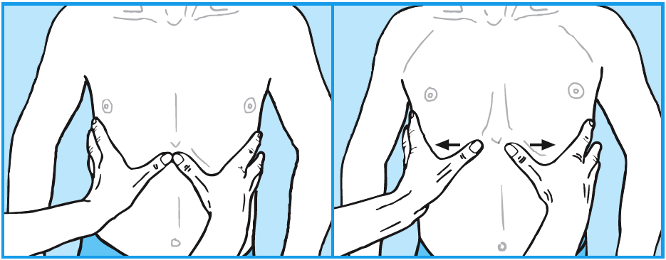

6 Lunger og luftveje
********************

:date: 2018-05-01 12:53
:category: Kapitler

**Nøglepunkter**

* Åndedrætsorganerne inddeles i de øvre luftveje, der strækker sig fra
  næsen til struben, og de nedre luftveje, der går til lungernes alveoli.
* En besværet og hvæsende vejrtrækning er karakteristisk for lungepatienten.
* Tør hoste ses ved irritation af de øvre luftveje. Produktiv hoste med
  slimet opspyt ses ved sygdom i de nedre luftveje.
* Hæmoptyse kan være et tegn på alvorlig lungesygdom.
* Den vigtigste del af den objektive undersøgelse af lungepatienten er
  beskrivelsen af almentilstanden med speciel fokus på farve, perifer
  cirkulation, respiration og hydrering.
* Central cyanose er et kardinaltegn på inkompenseret lungesygdom.

Symptomer
=========

De hyppigste symptomer er åndenød, hvæsen, hoste, opspyt og brystsmerter.

**Luftveje**

* Har du åndenød?
* Piber og hvæser det, når du trækker vejret? Gør det ondt?
* Har du hoste?
* Hoster du slim eller blod op?

Åndenød (dyspnø)
----------------

De fleste lungesygdomme giver åndenød. Patienten oplever det typisk
som besværet eller anstrengt vejtrækning og bruger udtryk som 
»*hiver efter vejret*« eller »*kan ikke få luft*«. Andre udtrykker det som funktionsnedsættelse,
f.eks. »*kan ikke længere klare trapperne*«. Ved kronisk lungesygdom
kan patienten gennem årevis være så vænnet til den nedsatte
lungefunktion, at man må spørge konkret for at vurdere det reelle funktionsniveau.

**Åndenød**

* Er vejrtrækningsbesværet nyligt opstået?
* Har du konstant åndenød, eller kommer det i anfald?
* Hvilke gøremål har du svært ved på grund af åndenød?
* Hvad kan forværre din åndenød (fysisk anstrengelse, fladt leje, pollen osv.)?
* Er der noget, der gør din vejrtrækning bedre?

**Årsager til åndenød – akut eller kronisk?**

+---------------+-----------+----------+----------------------------+
| **Minutter**  | **Timer** | **Dage** |  **Måneder/år**            |
+---------------+-----------+----------+----------------------------+
| Lungeemboli,  | Astma,    | Pleural  | Rygerlunger (kronisk       |
| Pneumothorax, | Pneumoni, | effusion | obstruktiv lungelidelse,   |
| AMI,          | Lungeødem |          | KOL),                      |
| Fremmedlegeme |           |          | Anæmi (blodmangel),        |
|               |           |          | Kronisk hjerteinsufficiens |
|               |           |          | (hjertesvigt),             |
|               |           |          | Tumor                      |
+---------------+-----------+----------+----------------------------+

Det kan være svært at skelne åndenød forårsaget af lungesygdom fra
åndenøden pga. hjertesygdom eller anæmi. Den besværede, »hvæsende«
vejrtrækning er typisk for lungepatienten, mens hjertepatienten klager
over åndenød, når de ligger fladt i sengen (*ortopnø*) om natten. Tit er
symptomatologien ikke så klar, og mange patienter kan også have både
hjerte- og lungesygdom.

**Hyperventilationstilfælde**

* Åndenød uafhængig af fysisk aktivitetsniveau
* Inspiratorisk åndenød
* Paræstesier i fingre og omkring munden
* Fjernhedsfornemmelse
* Dødsangst.

Hvæsen og piben
---------------

Pibende eller hvæsende vejtrækning er et symptom på forsnævring af de
nedre luftveje. Patienterne er ikke altid selv opmærksomme på, at deres
vejrtrækning larmer.Men det bemærkes af omgivelserne. Ved astma
optræder hvæsen typisk i anfald ledsaget af åndenød; imellem anfaldene
kan patienten være fuldstændig symptomfri. Ved rygerlunger (kronisk
obstruktiv lungelidelse) er patienten sjældent symptomfri, men graden
af piben og hvæsen varierer meget.

*Stridor* betegner den hivende mislyd og besværede vejrtrækning, der
ses og høres ved obstruktion af de øvre lufteveje, f.eks. fremmedlegme i
trachea eller slimhindeødem i strubehovedet (*laryngitis*).

Hoste (tussis)
--------------

Hoste er et almindeligt symptom og en hyppig årsag til henvendelse hos
praktiserende læge. Hoste udløses af receptorer i phraynx, larynx, trachea
og bronkier. Der skelnes mellem tør og produktiv hoste afhængigt
af, om hosten er ledsaget af opspyt eller ej. Ved sygdomme i de øvre luftveje,
f.eks. en banal virusinfektion, ses oftest en tør hoste, som dog kan
være meget generende for patienten. Ved sygdomme i de nedre luftveje,
f.eks. rygerlunger eller lungebetændelse er der typisk tale om produktiv
hoste med slimet opspyt. Lungebetændelse kan være ledsaget af en hoste
med »sidesting« pga. den ledsagende inflammation af lungehinderne
(*pleurit*).

Hoste kan være det eneste symptom på sygdom i luftvejene. F.eks. er
hoste ved anstrengelse og om natten karakteristisk for astma hos børn.
En tiltagende, behandlingsresistent hoste kan være første og eneste
symptom på en lungecancer. En ikke ualmindelig – men ofte overset –

**Hoste**

* Er det en tør hoste, eller kommer der slim med op?
* Ryger du?
* Har du halsbrand eller for meget mavesyre?
* Hvornår er hosten værst (ved anstrengelse, når du ligger
  ned, ved kontakt med dyr osv.)?

årsag til hoste er overløb af maveindhold til lungerne ved reflukssygdom
(se side 99); hosten ses typisk efter måltider og ved fladt leje. Hosten kan
være bivirkning til medicinindtagelse (ACE-hæmmere). Tænk altid på
patientens baggrund: Vedvarende hoste hos en somalisk invandrer bør
f.eks. føre til udredning for tuberkulose.

Opspyt (sputum og haemoptysis)
------------------------------

Slim, der hostes op fra bronkierne, kaldes *sputum* eller *ekspektorat*, men
har desværre fået den dårlige danske betegnelse »opspyt«. Det kan være
svært at skelne opspyt fra snot (fra næsen = *post-nasal drip*), fra mundens
eget spyt og fra maveindhold, der flyder over. Den bedste måde at
få afklaret, hvad det handler om, er at bede patienten producere noget
opspyt, mens du ser på. Slimet opspyt skyldes øget sekretion af *mucus*
(slim) i bronkierne som tegn på inflammation eller infektion. Hoste
med opspyt er så almindeligt hos storrygeren, at han ofte fortrænger
symptomet.Men direkte adspurgt indrømmer patienten som regel den
daglige (morgen)hoste med de gråbrune klatter, der er karakteristisk for
»rygerhosten«. Rigeligt, betændelsesagtigt (*purulent*) opspyt er karakteristisk
for akut bronkitis. Ved lungebetændelse (*pneumoni*) er det ofte
initialt en tør hoste, senere evt. rustrødt ekspektorat.

**Opspyt**

* Hvilken farve har opspyttet?
* Hvor ofte har du opspyt – er det altid eller kun af og til?
* Hvor meget kommer der?
* Sejt eller tyndt? (Er det svært at få det op?)

**Opspyt**

==========================  ==========================
**Udseende**                **Diagnoseforslag**
--------------------------  --------------------------
Gråligt                     Kronisk bronkitis (rygere)
Gulligt-grønt               Akut bronkitis
Rustrødt                    Pneumoni
Frådende, skummende opspyt  Lungeødem
Blodigt (hæmoptyse)         Tænk på lungecancer, lungeemboli 
                            og tuberkulose
==========================  ==========================

Blodigt opspyt (*hæmoptyse*) er ofte et tegn på alvorlig lungesygdom,
f.eks. kræft eller tuberkulose, men kan også ses som enkelte, isolerede
episoder ved luftvejsinfektioner. Det kan være svært at skelne hæmoptysen
fra blodigt opkast fra osophagus eller ventrikel (*hæmatemese*) eller
fra bagre næseblødning (*epistaxis*). Blødningen ved hæmoptyse er typisk
initialt friskt rødt, der senere aftager i mængder og bliver mørkere i farven.
Hæmatemese kan være helt friskt blodigt (ved f.eks. større blødning
fra oesophagusvaricer) eller kaffegrumsfarvet, når det kommer fra ventriklen
og mavesyren har denatureret det. Hæmatemese er ofte ledsaget
af kvalme og hæmoptyse er ofte ledsaget af hoste.

Brystmerter
-----------

Lungerne og det viscerale blad af pleura har ingen smertereceptorer. Det
har derimod det parietale blad, brystvæggen og strukturerne i mediastinum.
Typiske årsager til irritation af *pleura parietalis* er lungebetændelse
(*pneumoni*), sammenklappet lunge (*pneumothorax*) og blodprop i lungerne
(*lungeemboli*). Den pleurale smerte er skarp, som et sylesting og
forværres ved hoste og dyb inspiration. Den pleurale smerte er typisk for
den tørre pleurit, hvor de to pleurablade gnides mod hinanden. Udvikles
væskeansamling mellem pleurabladene (*effusion*), kan smerten forsvinde.

Den pleurale smerte kan som regel lokaliseres præcist af patienten.
Men hvis pleurabladet på diaphragma er involveret, kan smerten henføres
til abdomen eller skulderbladet. En inflammation af pleura kan gribe
over diaphragma til peritoneum og vice versa. Lidelser i brysthulen
(f.eks. en underlapspneumoni eller AMI) kan derfor manifestere sig som
akut abdomen, ligesom abdominale lidelser (f.eks. galdeblærebetændelse,
*cholecystitis*) kan manifestere sig med pleuralgia (smerter fra pleura).

Smerter i brystvæggen skyldes som regel enten costafrakturer eller
muskelforandringer. Disse smerter kan også forværres ved hoste og vejrtræning,
men i modsætning til pleurale smerter forværrres de også ved
f.eks. lejeændringer i sengen. Systemiske virusinfektioner (f.eks. influen-

**Brystsmerter**

* Kan du beskrive smerterne (skarpe og stikkende; dybe og
  borende eller overfladiske og brændende)?
* Er de konstante eller i takt med, at du trækker vejret?

**Brystsmerter**

+----------------------+-----------------+------------------------+
| Symptomer            | Smertetyper     | Diagnoseforslag        |
+======================+=================+========================+
| Skarp, stikkende,    | Pleural smerte  | Infektion, pneumo      |
| forværres ved dybe   |                 | thorax, thorax         |
| vejrtrækninger og    |                 | læsioner og sekundært  |
| hoste.               |                 | til abdominal sygdom   |
|                      |                 | (f.eks. cholecystitis) |
+----------------------+-----------------+------------------------+
| Dyb og dump,         | Parenkymatøs    | Lungecancer,           |
| konstant             | smerte          | mediastinum-lidelse    |
+----------------------+-----------------+------------------------+
| Forværres ved be-    | Smerte fra      | Traume, costafraktur,  |
| vægelse (i sengen)   | brystvæggen     | myoser, influenza,     |
|                      |                 | knoglemetastaser       |
+----------------------+-----------------+------------------------+
| Overfladisk,         | Neurogen smerte | Herpes zoster,         |
| brændende, evt.      |                 | torakal discusprolaps  |
| jagende              |                 |                        |
+----------------------+-----------------+------------------------+
| Knugende, udstråling | Hjertekrampe    | Iskæmiske hjertesygdom |
| til arm/hals         | (*angina*)      |                        |
+----------------------+-----------------+------------------------+
| Svien og brænden     | Halsbrand       | Reflukssygdom          |
| bag sternum          | (*pyrosis*)     |                        |
+----------------------+-----------------+------------------------+

za) kan give endog ganske kraftige muskelsmerter i brystvæggen. *Tietzes
syndrom* er en smertefuld inflammation i de øvre ribbensbruske. *Herpes
zoster* og torakal discusprolaps kan forsårsage smerter i brystvæggen ved
spinalrøddernes cutane innervation.
Ved akut opståede brystsmerter skal man altid overveje *iskæmisk
hjertesygdom* som differentialdiagnose (se side 69-71).

Objektiv undersøgelse
=====================

Den vigtigste del af den objektive undersøgelse af lungepatienten er beskrivelsen
af *almentilstanden* med speciel fokus på farve, perifer cirkulation,
respiration og hydrering, ligesom man altid skal måle puls, blodtryk,
temperatur og respirationsfrekvens (se kapitel 4). *Central cyanose* er
et kardinaltegn på inkompenseret lungesygdom.

**Ændret vejrtrækningsmønster**

+---------------+--------------------------+----------------------------+
| Betegnelse    | Type                     | Årsag                      |
+===============+==========================+============================+
| Kussmauls     | Meget dybe og            | Metabolisk acidose         |
| respiration   | »sukkende« respirationer | (f.eks. nyreinsufficiens,  |
|               | (prøver at udlufte CO2)  | diabetisk ketoacidose      |
|               |                          | og acetylsyreforgiftning)  |
+---------------+--------------------------+----------------------------+
| Hyper-        | Hurtig, dyb og forceret  | Psykisk                    |
| ventilation   | in- og eksspiration      |                            |
+---------------+--------------------------+----------------------------+
| Cheyne-Stokes’| Dybe, hyppige vejrtræk-  | CNS-skade, døende          |
| respiration   | ninger vekslende med     |                            |
|               | ophævet vejrtrækning     |                            |
|               | (apnø-perioder)          |                            |
+---------------+--------------------------+----------------------------+

Ved vurderingen af respirationen bemærkes, om den er rolig og ubesværet,
eller om patienten har en anstrengt og forceret respiration.
Antallet af respirationer pr. minut tælles. Den normale respirationsfrekvens
er i hvile 12-16 × min–1. En hurtig respiration benævnes *takypnø.*

**Cyanose (blålig misfarvning)**

+---------------+---------------------------+--------------------------+
| Betegnelse    | Type                      | Årsag                    |
+===============+===========================+==========================+
| Central       | På slimhinde, tunge       | Alvorlig hjerte og/eller |
| cyanose       | og læber                  | lungesygdom              |
+---------------+---------------------------+--------------------------+
| Perifer       | Perifert på ekstremiteter | Nedsat blodforsyning til |
| cyanose       | (fingre og tæer)          | ekstremiteterne. Ses ved |
|               |                           | blødningsshock, kolde    |
|               |                           | omgivelser, Raynauds     |
|               |                           | fænomen eller perifer    |
|               |                           | vaskulær sygdom          |
+---------------+---------------------------+--------------------------+

En akut påvirket patient med cyanose og besværet respiration kræver
hurtig vurdering og behandling. For den uøvede kan det være svært at
skelne f.eks. lungeødem fra obstruktiv lungelidelse, og nogle patienter
kan have både hjerte- og lungelidelse. Føler du dig ikke rutineret, så tilkald
hjælp!

Lungepatienten undersøges bedst siddende – så lettes hans vejrtrækning,
og du kan komme rundt om hele thorax. Er patienten sengeliggende
uden kræfter til at komme i siddende stilling, skal du altid bede om
hjælp til at løfte patienten, således at du kan lave en ordentlig undersøgelse.
Lungepatienten undersøges altid afklædt, stetoskopi kan *ikke* gennemføres
igennem tøjet.

Den objektive undersøgelse af lungepatienten suppleres som regel
med røntgenbillede af thorax og blodprøver, herunder blodgasanalyse
(arteriepunktur, se »Remedier og Teknik«). Ofte monitorerer astmapatienter
selv deres sygdom med et *peak flow*-meter, som er en let og hurtig
undersøgelse, der også kan udføres ved indlæggelsen på sygehuset. Som
regel bør man også ved indlæggelsen af lungepatienten monitorere blodets
iltmætning ved hjælp af et *pulsoksimeter*.

En grundig undersøgelse af lungepatienten omfatter også undersøgelse
af hjertet (specielt halsvenestase, hepatomegali og ascites som kan
være tegn på *højresidigt hjertesvigt* (se kapitel 5)), abdomen (se kapitel 7)
og lymfeglandlerne på halsen (se kapitel 4).

Inspektion
----------

Thorax’ *form* bemærkes. Et hyperinflateret, tøndeformet thorax er
karakteristisk for patienten med rygerlunger. Andre synlige deformiteter
af brystvæggen beskrives. *Pectus excavatum* eller »tragtbryst« er ikke helt
sjældent, men giver som regel kun kosmetiske symptomer. *Kyfoser* og
*skolioser* bemærkes ligeledes (se kapitel 10).

*Bevægeligheden* af thorax beskrives. Normalt trækker man vejret med
diaphragma, således at såvel brystkassen som abdomen udvider sig ved
inspirationen. Patienter med obstruktiv lungelidelse bruger ofte de
accessoriske respirationsmuskler på halsen, mens costa holdes vandrette
og fikserede. Ved udtrætning af diaphragma ses indtrækning af abdomen
under ribbenskurvaturen. Ved akut abdomen kan der ses ophævet medbevægelighed
af abdomen, der holdes fladt og fikseret ved kontraktion af
rectusmuskulaturen, mens respirationsarbejdet udføres af interkostalmuskulaturen.
Ved smerter i brystvæggen (f.eks. pleurit eller costafrakturer)
er respirationen hovedsageligt diafragmatisk.

**Inspektion**

* Thorax’ form?
* Egal bevægelighed?
* Medbevægelighed af abdomen?
* Indtrækninger?
* Brug af accessoriske respirationsmuskler?

*Paradoks respiration*, hvor thorax bevæger sig modsat det normale (indad
ved inspiration), ses ved løs thoraxvæg pga. multiple costafrakturer.
*Uegale thoraxbevægelser* kan ses ved pneumothorax og multiple costafrakturer,
men kan også være smertebetinget som ved lokal pleurit.
Thorax’ bevægelighed kan være svær at vurdere alene ved inspektion, og
man kan med fordel palpere symmetrien (se Fig. 6.1).

   **Fig. 6.1** Vurdering af asymmetri i thorax’ bevægelighed. Placer dine hænder om
   patientens bryst, så tommelfingrene netop mødes i eksspirationen. Men pas på at
   holde dine tommelfingre fuldstændigt i ro under inspirationen.

Palpation
---------

Perkussion
----------

Auskultation (stethoscopia pulmonum; st.p., lungestetoskopi)
------------------------------------------------------------