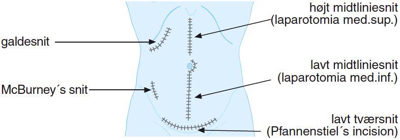
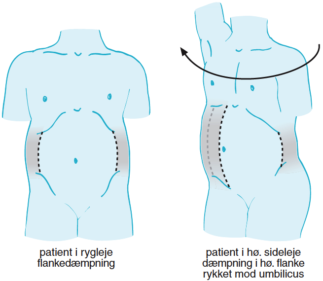

7 Mave-tarm-systemet
********************

:date: 2018-05-01 12:52
:category: Kapitler

**Nøglepunkter**

* Mave-tarm-systemet omfatter fordøjelseskanalen fra mund til anus
  med de tilhørende store kirtelsystemer: lever, galdeveje og pancreas.
* Kvalme, opkastning og forstoppelse skyldes hyppigt lidelser i mave-
  tarm-systemet, men kan også være forårsaget af f.eks. medicinindtagelse.
* Mavesmerter er en meget hyppig årsag til lægehenvendelse, men
  symptomet er uspecifikt, og en præcis anamnese er vigtig for at
  målrette udredningsprogrammet.
* Kernen i den objektive undersøgelse er at afsløre ømhed og udfyldninger
  i abdomen ved grundig palpation.

Symptomer
=========

De vigtigste symptomer fra mave-tarm-systemet er kvalme, opkastninger,
synkebesvær, mavesmerter samt ændret afføringsmønster, herunder
blødning.

**Mave-tarm-systemet**

* Har du kastet op eller haft kvalme?
* Har du problemer med at synke maden?
* Har du halsbrand eller sure opstød?
* Har du haft ondt i maven?
* Har du afføring lige så ofte, som du plejer?
* Ser din afføring ud, som den plejer?

Anæmi (blodmangel) skyldes ofte sygdom i mave-tarm-systemet, og en
grundig mave-tarm-anamnese er derfor vigtig hos patienten med uforklarlig
anæmi.

Manglende appetit og vægttab er hyppige ledsagesymptomer til alvorlige
mave-tarm-lidelser (se kapitel 4).

Kvalme (nausea) og opkastning (emesis)
--------------------------------------

Kvalme er fornemmelsen af, at man skal kaste op, men den behøver ikke
at være ledsaget af opkastninger. Opkastning er en voldsom sammentrækning
og udtømmelse af mavesækken; som regel lindres kvalmen ved
opkastninger.

**Kvalme og opkastning**

* Har du kvalme konstant eller kun en gang imellem?
* Hvordan ser opkastet ud? Føderester? Frisk blod?
* Kaffegrums-lignende?
* Tager du noget medicin?
* Kunne du være gravid?

Kvalme og opkastninger skyldes ofte sygdomme i mave-tarm-systemet,
men andre hyppige årsager er: graviditet, medicin (f.eks. morfin, digoxin,
cytostatika), stofskiftesygdomme (f.eks. diabetisk ketoacidose) og postoperativ
kvalme.

Opkast med føderester benævnes *alimentære* opkastninger. Opkast
med blod benævnes *hæmatemese* og kan være i form af frisk rødt blod
eller sorte hæmatinkorn (»kaffegrums«). *Fækulent* opkast betegner et
brunt, ildelugtende opkast, der typisk ses ved ileus-tilstande (tarmslyng).

Synkebesvær (dysfagi)
---------------------

Synkebesvær er, når maden »sidder fast« i halsen. Det kan være det første
symptom på kræft i spiserøret, udposninger på spiserøret eller
inflammation i mund eller hals.
Fornemmelsen af en »klump i halsen« benævnes *globulus*-fornemmelse og er et 
hyppigt symptom. Der er ikke egentligt synkebesvær, dvs.
måltiderne indtages uden problemer. Ofte findes ingen organisk årsag.

Halsbrand (pyrosis)
-------------------

Halsbrand er en sviende og brændende smerte bag brystbenet. Symptomet
er et tegn på irritation af slimhinden i oesophagus, og den hyppigste
årsag er tilbageløb (*refluks*) fra ventriklen. Halsbrand udløses eller forværres
ofte ved foroverbøjning eller sengeleje. Ofte ledsages halsbrand af
bøvseri (*ructus*) og sure opstød (*regurgitation*), dvs. fornemmelsen af
mavesyre i munden. Regurgitation er ikke ledsaget af kvalme eller sammentrækninger
af mavesækken ligesom egentlige opkastninger.

Anamnesen til patienten med halsbrand sigter på at skelne den sporadiske
halsbrand, der ses efter overdådige måltider (julefrokosten!) fra
symptomer på behandlingskrævende reflukssygdom eller alvorlig oesophaguslidelse.

**Halsbrand**

* Beskriv smerten! Er den brændende/sviende eller
  voldsom/trykkende?
* Hvor sidder smerten? Stråler den nogen steder hen?
* Har du haft sure opstød? Kortåndethed?
* Er det noget særligt, der udløser smerten (fed mad, alkohol,
  kaffe, foroverbøjning, anstrengelse)?
* Lindres smerten af syreneutraliserende middel? Nitroglycerin?
* Hjælper det at ligge fladt i sengen, eller bliver det bare værre?

Med en grundig anamnese (og et ekg + blodprøver) kan man som regel
også udelukke den anden store årsag til smerter bag brystbenet: iskæmisk
hjertesygdom (se kapitel 6).

Mavesmerter (abdominalia)
-------------------------

Forsøg at få en præcis karakteristik af smerterne inkl. forværrende og
lindrende faktorer.

**Mavesmerter**

* Hvilken tid på dagen har du ondt?
* Hvor sidder smerterne? Stråler de nogen steder hen?
* Er smerterne konstante eller turevise (kolikagtige)?
* Beskriv smerterne! (dumpe, gnavende, skærende etc.)
* Startede smerterne pludseligt eller snigende?
* Kan du passe dit arbejde, eller må du ligge i sengen?
* Er nattesøvnen forstyrret?
* Er der noget specielt, der forværrer eller lindrer smerterne
  (f.eks. afføring, fødeindtagelse, medicin)?

Lindring efter flatus og afføring er typisk for colonlidelser. Forværring
ved fødeintagelse er typisk for refluks-oesophagitis, betændelse i bugspytkirtlen
(*pancreatitis*) og mesenterial iskæmi. De klassiske mavesårssmerter
beskrives med forværring ved sult (*hungersmerter*) og lindring

<html5media>File:FIG7-1.mp3</html5media>

   **Fig. 7.1** Viscerale smerter er ofte diffuse med en karakteristisk udstråling eller
   repræsentation (referred pain) på kroppen: Smerter fra ventriklen og duodenum
   går i epigastriet. Smerter fra tyndtarm og højresidige colon går til området
   omkring navlen (periumbilikalt). Smerter fra venstresidige colon og
   sigmoideum sætter sig over symfysen. Irritation af diaphragma, som det f.eks.
   ses ved betændelse i galdeblæren, giver smerteudstråling til spidsen af højre
   skulderblad. Ved sygdom i pancreas stråler smerten i ryggen. Smerter fra
   urinvejene stråler ud i lyske og scrotum.

ved indtagelse af antacida eller føde (*fødelindring*), men kan også mangle
helt ved mavesår.

Afføringsmønster
----------------

Nylige ændringer i afføringsmønster, særligt med ledsagende smerter, er
ofte tegn på organisk sygdom. De vigtigste ændringer i afføringsmønster
er forstoppelse, diaré og blod i afføringen.

**Forstoppelse (obstipatio)**

Forstoppelse er en besværlig og anstrengende afgang af hårde og knoldede
afføringer med lange mellemrum. Ved udspørgen af patienten er det
vigtigt at opklare, om obstipationen er nyopstået eller en del af patientens
livsstil (stillesiddende arbejde, fiberfattig kost osv.), og om der er
umiddelbare forklaringer på eventuelle ændringer (f.eks. medicin).

**Obstipation**

* Skal du presse meget, eller har du smerter ved afføring?
* Hvornår havde du sidst afføring?
* Vægttab?
* Blod i afføringen?
* Tager du noget medicin (opiater)?
* Bevæger du dig? Beskriv dine måltider? Væskeindtagelse?

Smerter ved anus (f.eks. analfissurer) kan være både årsag og virkning
ved obstipation.Megen forstoppelse skyldes livsstilsfaktorer, men det er
vigtigt ikke at overse en *coloncancer* som årsag.

**Diaré**

Diaré er hyppige, tynde afføringer med en *øget* samlet faecesmængde.
Hovedformålet med de uddybende spørgsmål er at skelne den akutte,
selvlimiterende (ofte infektiøse) diaré fra den kroniske diaré, der kræver
yderligere undersøgelser. Hos mange patienter, der klager over »tynd
mave« vil man ved indsamling af faeces under indlæggelse finde, at
denne har normal mængde og udseende. Der er derfor vigtigt med sin
anamnese at få præciseret problemets omfang.

**Diaré**

* Hvor hyppigt har du afføring?
* Må du skynde dig på toilettet, eller kan du holde dig til en passende lejlighed?
* Skal du op om natten for at have afføring?
* Beskriv din afføring! Blod, slim eller pus?
* Udenlandsrejse? Lignende tilfælde i omgangskredsen?

Diaré ud over 14 dage med ledsagesymptomer som vægttab, feber, blod
og slim i afføringen eller natlig forekomst er ofte tegn på alvorligere,
organisk lidelse, f.eks. inflammatorisk tarmsygdom. Ildelugtende, store
og blege diaréer, der flyder ovenpå i toiletkummen, ses ved malabsorptionssygdomme,
betændelse i bugspytkirtlen (*pancreatitis*) og amøbesygdom
(*giardiasis*). Udenlandsrejser, restaurantbesøg og lignende tilfælde i
omgangskredsen tyder på infektiøs årsag. *Tyreotoksikose* (forhøjet stofskifte)
er en vigtig differentialdiagnose ved diaré og vægttab (se kapitel 13).

**Blod i afføringen**

Blod i afføringen kan ses som en frisk rød misfarvning af faeces (*hæmatokesi*)
ved distale blødningskilder eller som en sort og tjæreagtig afføring
(*melaena*) ved mere proksimale blødninger (f.eks. mavesår). Indtagelse
af jern giver en sortfarvning af faeces, der ikke kan forveksles med
melaena (som er fælt ildelugtende).

**Blod i afføringen**

* Er blodet blandet ind i afføringen, eller er det som striber
  uden på? Er der blodigt kummesprøjt eller blod på toiletpapiret?
* Har du tidligere haft mave-tarm-sygdomme, f.eks. mavesår,
  polypper eller hæmorider?
* Feber? Diaré? Vægttab?
* Tager du binyrebarkhormoner eller smertestillende/
  gigtmedicin som f.eks. ibuprofen?

Blod i afføringen vil altid føre til et udredningsprogram, der kan omfatte
ano-rektoskopi (se »Remedier & Teknik«) og evt. gastroskopi og koloskopi.

Gulsot (icterus)
----------------

Gulsot er gulfarvning af hud og øjne. *Icterus* er det kliniske fund af gulfarvet
hud og sclerae. *Hyperbilirubinæmi* er det tilsvarende parakliniske
fund. Hyppige ledsagesymptomer er kløe og appetitløshed. Anamnesen
sigter på at skelne mellem parenkymatøse (hepatitis, cirrose), obstruktive
(galdesten, tumorer) og hæmatologiske (hæmolyse-) årsager. Det er
vigtigt at få afdækket, om patienten tilhører en af risikogrupperne for
smitsom hepatitis: indvandrere og flygtninge fra endemiske områder,
intravenøse stofmisbrugere osv.

**Gulsot**

* Hvilken farve har urin og afføring? Har du hudkløe? Har du
  pludseligt fået svært ved at passe bukserne (ascites)?
* Har du tidligere haft galdesten, leversygdom eller kræft i
  mave-tarm-systemet?
* Nylige udenlandsrejser? Er der lignende tilfælde i omgivelserne?
* Har du nogensinde fået blodtransfusion?
* Er du eller har du været stiknarkoman?
* Har du haft ubeskyttet sex? Prostituerede?
* Hvor meget alkohol drikker du til daglig?

Objektiv undersøgelse	
=====================

Mave-tarm-systemet er tilgængelig for direkte klinisk undersøgelse ved
dets ydre åbninger – mund og endetarm – og for indirekte undersøgelse
gennem bugvæggen. Hos kvinder med abdominale symptomer foretages
desuden en gynækologisk undersøgelse (side 131), og hos mænd undersøges
*genitalia externa* (side 122). Ofte suppleres tillige med billeddiagnostiske
undersøgelser som ultralyd, røntgenoversigt over abdomen
eller CT-scanning. Røntgenbillede af thorax og ekg kan bidrage væsentligt
i differentialdiagnosen, da både pneumoni og iskæmisk hjertesygdom
kan manifestere sig med mavesmerter.

Mund og svælg (cavum oris et fauces)
------------------------------------

**Inspektion**

Læber og mundvige undersøges for sår (*ulcerationer*), vesikler (f.eks. herpes
labialis) og fissurer. Hos traumepatienten undersøger man for tandskader,
som kan være afsprængninger (*kronefrakturer*), løse eller manglende
tænder (hhv. *luksationer* og *eksartikulationer*). Ved beskrivelse af
tandskader skal man være så præcis som muligt – det kan ofte få betydning
i senere forsikringssager.

<html5media>File:FIG7-2.mp3</html5media>

   **Fig. 7.2** De enkelte tænder benævnes lettest
   a.m. Haderup: De fire fortænder har alle nr.
   1, og tænderne lateralt herfor benævnes 2, 3,
   4 osv. Tænderne i højre side af overmunden
   har endelsen »+«, i venstre side af overmunden
   har de fortegnet »+«, i højre side af
   undermunden har de endelsen »÷« og i
   venstre side af undermunden fortegnet »÷«.
   Den venstre øverste fortand hedder således
   »+1«, og den højre nederste visdomstand
   hedder »8 ÷«.

*Tandabscesser* kan være forklaringen hos en patient med feber af ukendt
årsag. Den normale mundslimhinde er rosa og fugtig; blege slimhinder
er et tegn på anæmi. Tørre slimhinder kan ses ved dehydrering og
mundånding. Rødme af slimhinden kan ses ved inflammation (f.eks.
*candida*). Ved mangelanæmier (jern- og B12-) er et karakteristisk fund en
atrofisk tungeoverflade med manglende papiller (*papilatrofi*). Ved
inspektion af fauces undersøges for rødme, hævelse og belægning af
ganebuer og tonsiller, som det ses ved halsbetændelse (*tonsillitis*) eller
mononukleose.

**Eksploration**

Ved ansigtstraumer er det vigtigt at gennempalpere alle tænder for løshed
og at undersøge mandiblen for frakturømhed og strepitus (se side 141). 
Et forkert sammenbid (malokklusion) efter kæbefraktur afsløres bedst ved at spørge patienten.

Abdomen
-------

Abdomen afgrænses opadtil af ribbenskurvaturen og processus xiphoideus,
nedadtil af lyskerne og symfysen.

<html5media>File:FIG7-3.mp3</html5media>

.. figure:: Figurer/FIG7-3_png.png
   :width: 500 px
   :alt:  Fig. 7.3 Abdomen.

   **Fig. 7.3** Når man skal beskrive sine fund af ømhed, udfyldninger
   m.v., inddeles abdomen i fire kvadranter (7.3.a.). En mere detaljeret
   opdeling beskriver ni mere uskarpt afgrænsede segmenter (7.3.b.).

**Inspektion**

Betragt den passende afklædte patient der ligger fladt i sengen med sænket
hovedgærde. Det normale abdomen bevæger sig synkront med respirationen
(*ud*\ spiles ved *in*\ spiration). Hos slanke patienter kan man se en
»meddelt pulsation« fra aorta. Det er derimod ikke normalt at kunne se
tarmperistaltikken eller konturerne af enkelte organer igennem bugvæggen.
Ved svær kronisk obstruktiv lungelidelse (KOL) ses *ind*\ trækning af
abdomen ved *in*\ spiration pga. slap diaphragma. Et rigidt eller indtrukket
abdomen (manglende respirationssynkron bevægelighed) ses ved 
universel inflammation af bughinden (*peritonitis*, f.eks. perforeret *ulcus*
(mavesår)).

Et asymmetrisk abdomen ses ved en lokaliseret udspilning pga. et
eller flere forstørrede organer. Abdomen beskrives da som toppet f.eks.
over symfysen (overfyldt urinblære, forstørret uterus), i venstre fossa
(obstiperet sigmoideum, tumor) eller under højre kurvatur (fedtlever).

Synlig tarmperistaltik kaldes tarmrejsning og ses ved obstruktiv *ileus*
(tarmslyng). Lokaliserede udbulinger af selve bugvæggen vil næsten altid
være *hernier* (brok). Et diffust udspilet (opdrevet) abdomen kan ses ved
ascites, ileus, ovarietumorer m.v. Et omfangsforøget abdomen kan være
svært at skelne fra almindelig fedme. Spørg patienten, om bukserne
pludselig er begyndt at stramme. Et tidligt objektivt fund ved ascites er
udslettet navlegrube, senere i forløbet ses et decideret navlebrok. Ved
massiv intraabdominal blødning (f.eks. rumperet ekstrauterin graviditet)
kan ses en blålig misfarvning af abdominalhuden. En øget venetegning
radierende fra umbilicus ses ved portal hypertension (*caput Medusae*).

Ar (*cikatricer*) efter tidligere operationer beskrives. Friske operationssår
undersøges altid for defekter (brok) og tegn på infektion (varme,
ømhed, rødme, hævelse, pus).

**Inspektion af abdomen**

* Fladt eller udspilet?
* Normal respirationsbevægelighed eller rigidt/indtrukket abdomen?
* Symmetrisk eller toppet?
* Tarmrejsning?
* Operationssår og cikatricer?

<html5media>File:FIG7-4.mp3</html5media>

   **Fig. 7.4** Nøgle til beskrivelse af bugvægscikatricer.

<html5media>File:FIG7-5.mp3</html5media>

   **Fig. 7.5** Ved massiv ascites finder man hos patienten i rygleje en karakteristisk
   periumbilical tympanisme med symmetrisk dæmpning i begge flanker svarende
   til at væsken følger tyngdekraften ned, mens de luftfyldte tarme flyder ovenpå.
   Ved kuglepensmarkering af luft/væske-grænsen kan man ved ascites
   demonstrere, at den laterale afgrænsning flytter sig ved lejeskift. Fænomenet
   kaldes dekliv dæmpning.

**Palpation af abdomen**

* Patienten i rygleje med bøjede ben.
* Afled opmærksomheden fra undersøgelsen. Start længst væk fra smerten.
* Let palpation: Direkte eller indirekte trykømhed? Slipømhed? *Defénse?*
* Dyb palpation: Dyb ømhed? Abnorme udfyldninger? Organomegali?
* Udfyldninger og organomegali: ømhed, lokalisation,
  størrelse, form, overflade, konsistens og mobilitet.

**Palpation**

Patienten ligger fladt i sengen med let bøjede knæ og hofter og med
hænderne ned langs siden eller under lænd og sæde. En venlig og interesseret
afledning (snak om vind og vejr) af patientens opmærksomhed

<html5media>File:FIG7-6.mp3</html5media>

   **Fig. 7.6** Efter hvad der passer én bedst, kan man bruge én eller to
   hænder ved palpation af abdomen.

fra undersøgelsen er ofte utroligt værdifuldt. Beder man patienten om at
slappe af i maven, får man ofte det modsatte resultat!

Man indleder med en *let palpation*, gerne startende med en flad rolig
hånd, der hviler på abdomen, indtil patienten er afslappet. Start altid din
undersøgelse længst væk fra det sted, hvor patienten angiver smerte.
Efter hvad der passer én bedst, kan man bruge én eller to hænder (jf. Fig.
7.6.). Bed patienten angive, hvis undersøgelsen udløser smerte, men
betragt samtidig patientens ansigt, mens du palperer for at fange den
uudtalte smertereaktion. Formålet med den lette palpation er at afsløre
tegn på peritoneal irritation. *Direkte trykømhed* over det syge organ er
som regel det tidligste tegn. *Indirekte trykømhed* ses, når smerte udløses
et andet sted i abdomen end dér, hvor der trykkes. *Perkussionsømhed*
angiver ømhed ved perkussion. *Slipømhed* findes, når man gradvist og
langsomt trykker i dybden på et ømt sted og smerten herefter udløses
eller forværres, når man pludselig slipper. *Défense* (eller mere præcist
*défense musculaire* = muskelværn) er reflektorisk spænding af bugvægsmuskulaturen
udløst af stærk smerte. Det kan være svært at skelne
*défense* fra voluntære muskelspændinger hos den anspændte patient; det
er her vigtigt at undersøge, om en *défense* lader sig reproducere under
maksimal afledning af patienten. Både trykømhed, slipømhed og *défense*
kan være lokaliseret eller diffus. Ofte er der tale om et udviklingsmønster
i palpationsfundene ved akut intraabdominal lidelse, således at lokaliseret
direkte trykømhed ses tidligt ved lokaliseret vævsirritation, mens diffus
*défense* (»bræthårdt abdomen«) ses sent i forløbet som udtryk for
diffus peritonitis

Efter den lette palpation fortsættes med *dyb palpation*, hvor man
borer sine fingerspidser så dybt i abdomen, som patienten tillader. 
Formålet er her at finde forstørrede organer og andre udfyldninger og at
finde en dybere ømhed, der kan repræsentere udspilede eller inflammerede
organer. Den dybe palpation kan være ubehagelig for patienten,
men det er vigtigt, at patienten ikke forveksler ubehaget med den ægte
dybe, viscerale smerte. Ledsag eventuelt den dybe palpation med at sige
til patienten: »Jeg ved godt, at det her er ubehageligt. Men gør det ondt?
Er det den samme smerte, som du tidligere har følt?«. Den dybe palpation
udføres også systematisk kvadrant for kvadrant.Man eftersøger
organerne ud fra sit kendskab til normalanatomien, men regn ikke med,
at du kan udpalpere organer, medmindre de er væsentligt forstørrede.
Det normale abdomen er uden udfyldninger eller ømhed. Ved fund af
abnorme udfyldninger og forstørrede organer (*organomegali*) vurderes
deres ømhed, lokalisation, størrelse, form, overflade, konsistens og mobilitet.
Ved nyopdagede abnorme udfyldninger vil man som regel supplere
med ultralydsundersøgelse, CT-scanning eller kikkertundersøgelse.

I *nederste venstre kvadrant* er en faecesfyldt sigmoideum et normalt
fund ved dyb palpation; konsistensen er som modellervoks. Hårdere og
faste udfyldninger kan skyldes obstipation eller en tumor i colon eller
ovarium. En øm udfyldning kan repræsentere en irriteret peritoneum
omkring sigmoideum (*perisigmoiditis*), som det ses ved f.eks. *diverticulitis coli.* 
Ømhed i nedre abdomen hos en fertil kvinde skal betragtes som

**Stigmata ved leversygdom**

* *Hos patienter med kronisk leversygdom ser man ofte en række karakteristiske fund (stigmata):*
* Hepato- og splenomegali
* Ascites
* Icterus
* Caput medusae, oesophagusvaricer og hæmorider
* Spider naevi
* Palmart erytem
* Dupuytrens kontraktur
* Gynækomasti og testisatrofi
* Slimhinde- og hudblødninger
* *Paper-money skin* (cirrose-teint).

<html5media>File:FIG7-7.mp3</html5media>

   **Fig. 7.7** Ved palpation af leveren starter
   man udefra og bevæger sig ind: Placer
   højre hånds fingerspidser umiddelbart
   til højre for rectus-muskulaturen på
   højde med navlen og flyt med små
   vuggende bevægelser gradvist fingrene
   nærmere ribbenskurvaturen. Forsøg at
   synkronisere dine bevægelser med patientens
   respiration, således at stødet
   fremad-nedad falder samtidig med patientens inspiration, hvor leveren presses
   ned i abdomen af diaphragma. Når man mærker leverkanten støde mod sine
   fingerspidser, bemærker man, om den er blød og buttet (som ved fedtlever) eller
   hård og puklet (som ved cirrose eller metastaser), og man angiver afstanden i cm
   til højre kostalrand i medioklavikulærlinien.

en ekstrauterin graviditet, indtil man har bevist det modsatte (negativ
graviditetstest). *Salpingitis* og *ovariecyster* er andre muligheder.

*Over symfysen* er de hyppigste udfyldninger en fyldt urinblære, en
gravid uterus eller en fibromatøs uterus.

I *nederste højre kvadrant* ses hos kvinder – som i venstre side – den
*ekstrauterine graviditet*, *salpingitten* (underlivsinflammation) og *ovarietumorer*.
En hård og øm udfyldning kan være en *coloncancer* eller en
inflammatorisk tarmsygdom. Den hyppigste årsag til ømhed eller *défense*
i nedre højre kvadrant er imidlertid *appendicitis acuta*.

I *øverste højre kvadrant* er de hyppigste fund en forstørret lever eller
en øm galdeblære. Den normale eller cirrotisk skrumpede lever kan ikke
palperes (men evt. udperkuteres jf. side 111). En forstørret lever kan palperes
ved *fedtlever*, *cirrose* og *levermetastaser*.

Ømhed på galdeblærestedet (*Murphys tegn*) evt. med *défense* er det klassiske
fund ved betændelse i galdeblæren (*cholecystitis*). Fundet af en stor
og spændt, men uøm galdeblære kaldes *Courvoisiers tegn* og kan ses ved
en cancer, der obstruerer udløbet fra galdevejene. Symptomer og kliniske
fund ved lidelser i galdevejene er imidlertid meget usikre, og man vil
som regel supplere med en ultralyds- eller kikkertundersøgelse.

I *epigastriet* er ømhed et hyppigt og meget uspecifikt fund, mens
udfyldninger er sjældne. *Over umbilicus* kan et aortaaneurisme palperes
som en ekspansivt pulserende udfyldning (side 186).

I *venstre øvre kvadrant* er det hyppigste fund en forstørret milt (*splenomegali*),
der evt. kan være øm (et hyppigt fund ved *mononukleose*).

Teknikken ved palpation af milten er som beskrevet for leveren. Ved
undersøgelsen af milten skal patienten ligge på højre side og man skal
synkronisere sine bevægelser med patientens respiration. Ligesom for
leveren er den kliniske vurdering af milten vanskelig, og man supplerer
derfor ofte med en ultralydsundersøgelse.

**Årsager til splenomegali**

* Mononukleose
* Levercirrose
* Leukæmi, lymfomer og myeloproliferative sygdomme
* Malaria
* Hepatitis
* Hæmolytisk anæmi
* Idiopatisk trombocytopeni
* Amyloidose.

I flankerne kan nyrerne palperes (kapitel 8, side 125).

**Perkussion**

Teknikken ved perkussion er som beskrevet for lungerne (side 93). Det
normale perkussionsfund i abdomen er overalt en lyd, som når man slår
på et slapt trommeskind (tympanisme). Ved perkussionen forsøger man
at afgøre, om en diffus udspiling skyldes luft (f.eks. ileus), der giver tympanisme,
eller væske (f.eks. ascites) og forstørrede organer (f.eks. hepatomegali),
der giver dæmpning. Den kliniske vurdering af et udspilet
abdomen er imidlertid upræcis, og man supplerer ofte med en ultralydsundersøgelse
(der kan påvise selv små mængder ascites) eller en røntgenoversigt
over abdomen (der er første skridt i ileusdiagnostik).

Lever-, milt- og blæreforstørrelse er de hyppigste perkussionsfund i
abdomen. Ved perkussion bevæger man sig altid gradvist fra et område
med tympanisme til et område med dæmpning. Ved udperkussion af en
*forstørret blære* bevæger man sig således fra umbilicus mod symfysen –
normalt er perkussionsfundet tympanitisk hele vejen. En forstørret blære
erkendes som en dæmpning, og udbredelsen angives (som f.eks.
»2 cm under umbilicus«).

+-----------------------------------------------------------------+
| **Perkussion af abdomen**                                       | 
|                                                                 |
| * Patienten i rygleje. Bevæg de perkuterende fingre fra områder |
|   med tympanisme til områder med dæmpning.                      |
| * Hepatomegali: dæmpning under højre kurvatur i MCL             |
|   (medio-claviculær-linjen).                                    |
| * Splenomegali: dæmpning på en linie strækkende sig fra         |
|   spidsen af IC IX sin. mod umbilicus.                          |
| * Urinretention: dæmpning over symfysen.                        |
| * Ascites: dekliv flankedæmpning, flytbar ved lejeskift.        |
+-----------------------------------------------------------------+

Manglende leverdæmpning er et uspecifikt fund, men kan skyldes fri luft
i abdomen (perforeret hulorgan, nylig operation).

Lyskerne (regiones inguinales)
------------------------------

Endetarm (rectum)
-----------------