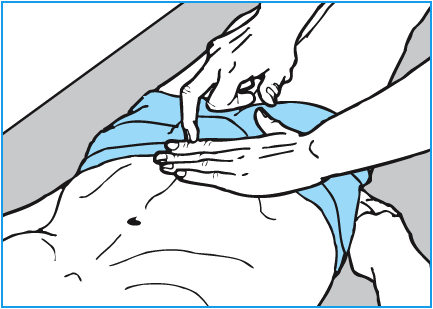

8 Nyrer, urinveje og mandlige kønsorganer
*****************************************

:date: 2018-05-01 12:51
:category: Kapitler

* **Link to machine translation of this page to english:** `Google Translate <https://translate.google.com/translate?sl=da&hl=en&u=http://wiki.hoer-laegedansk.dk/8_Nyrer,_urinveje_og_mandlige_kønsorganer>`__
* **Oplæsning for hele kapitlet:** <html5media>File:HELE8.mp3</html5media>

**Nøglepunkter**

<html5media>File:KAP8_116.mp3</html5media>

* De øvre urinveje omfatter nyrebækkenet og urinlederne (ureteres).
  De nedre urinveje omfatter urinblæren og urinrøret (urethra). De
  mandlige genitalier omfatter penis, pungen, testiklerne og epididymis.
* Symptomerne ved parenkymatøse nyresygdomme er ofte almene og
  uspecifikke som træthed, ødemer og kvalme.
* De hyppigste symptomer ved lidelser i de øvre urinveje er smerte og
  blod i urinen (hæmaturi).
* De hyppigste symptomer ved lidelser i de nedre urinveje er smerte
  og svie ved vandladning (dysuri), besværet eller hyppig vandladning
  (stranguri, pollakisuri) og ufrivillig vandladning (inkontinens)
* Kernen i den objektive undersøgelse er at kunne afsløre en øm nyre,
  en fyldt blære, en forstørret prostata og en abnorm udfyldning i
  scrotum.

Subjektivt
==========

<html5media>File:KAP8_116_2.mp3</html5media>

Parenkymatøse nyresygdomme manifesterer sig med almene og uspecifikke
symptomer som f.eks. træthed og appetitløshed, eller det kliniske
billede kan være domineret af den primære sygdom, der er årsag til patientens
nyrelidelse, f.eks. sendiabetiske komplikationer. Derimod viser de
kirurgiske urinvejssygdomme som f.eks. nyresten og prostatahypertrofi
sig ofte med klassiske symptomer. De hyppigste symptomer er: smerte,
*dysuri* (svien eller smerte ved vandladning), *urge* (pludselig og uimodståelig
vandladningstrang), *pollakisuri* (hyppig vandladning), *nykturi*
(natlig vandladning), *stranguri* (igangsætningsbesvær), efterdryp, manglende
blæretømning, *inkontinens*, *hæmaturi* (blod i urinen), og *ødemer*
(væskeophobning i kroppen).

**Nyrer og urinveje**

<html5media>File:BOKS117.mp3</html5media>

* Svier det, eller gør det ondt, når du tisser?
* Er du generet af pludselig vandladningstrang?
* Hvor ofte går du på toilettet for at tisse?
* Skal du op om natten for at tisse?
* Har du besvær med at komme af med vandet?
* Har du problemer med at holde på vandet?
* Har du blodig urin?
* Har du væske i kroppen, dvs. hævede ben eller hævelse i ansigtet?

Parenkymatøse nyresygdomme kan være sekundære til systemiske sygdomme,
f.eks. diabetes, eller primære nyresygdomme kan give systemiske
komplikationer, f.eks. anæmi, hjertehindebetændelse (*pericarditis*) og
hypertension. En grundig anamnese, der dækker alle organsystemer, er
derfor vigtig hos nyrepatienten. Hos kvinder med symptomer fra de
nedre urinveje er den gynækologiske anamnese vigtig `(kapitel 9) <9_Kvindelige_kønsorganer.rst#>`__ .

Smerter
-------

<html5media>File:KAP8_117.mp3</html5media>

Smerter er hyppige ved lidelser i urinvejene som nyresten og infektion.

**Smerte**

<html5media>File:BOKS117B.mp3</html5media>

* Er smerten konstant eller turevis?
* Kom den pludseligt eller snigende?
* Hvor sidder smerten?
* Stråler den nogen steder hen?
* Svier det, eller gør det ondt, når du tisser?

Ved det akutte nyrestensanfald (*urolithiasis*) er der typisk pludseligt indsættende,
kraftige og turevise (kolikagtige) smerter lokaliseret ud for
obstruktionen med en karakteristisk udstråling (Fig. 8.1). Ved nyrebæk-

<html5media>File:FIG8-1.mp3</html5media>

   **Fig. 8.1** Nyresten. Ved sten i de øvre urinveje
   er der karakteristiske udstrålinger af smerten.
   A: sten i nyrebækken.
   B: sten i øvre ureter.
   C: sten i nedre ureter.

kenbetændelse (*pyelonephritis acuta*) er der typisk dumpe flankesmerter,
feber og evt. dysuri. Blærebetændelse (*cystitis*) giver typisk smerter over
symfysen, dysuri og pollakisuri. Smerterne ved urinretention er lokaliseret
mellem symfysen og umbilicus. Smerter i scrotum kan skyldes bitestikel-
betændelse (*epididymitis*), *torsio testis*, eller indeklemt lyskebrok
(ingvinoskrotalt hernie, se `side 124) <8_Nyrer,_urinveje_og_mandlige_kønsorganer.rst#Vand_i_kroppen_(ødemer)>`__ . *Hydrocele* (vandbrok) og *varicocele*
(årebrok) giver som regel ikke smerter, men tyngdefornemmelse. Testistumoren
manifesterer sig sjældent med smerter.

Svie og smerte ved vandlanding (dysuri)
---------------------------------------

<html5media>File:KAP8_118.mp3</html5media>

Dysuri forårsages af lidelser i urethra eller blære. Anamnesen forsøger at
afdække øvrige symptomer, der kan give et fingerpeg om diagnosen:

**Dysuri**

<html5media>File:BOKS118.mp3</html5media>

* Er der udflåd fra urinrøret?
* Er der blodig urin?
* Oplever du pludselig vandladningstrang?
* Skal du løbe tit på toilettet? Bliver det kun til små-sjatter?

Ved lidelser i urethra er der sædvanligvis ikke *urge* og pollakisuri, men
der kan være udflåd. *Urethritis* (betændelse i urinrøret) er oftest en seksuelt
overført sygdom (*chlamydia, gonoré*), men kan også være led i en
reaktiv artrit (*mb. Reiter*). Hos kvinder kan uretrale symptomer skyldes
lokal irritation og østrogenmangel. Ved blærelidelser (f.eks. *cystit*, blærebetændelse)
er dysuri derimod ikke ledsaget af udflåd, men som regel af
urge og pollakisuri og evt. hæmaturi. Blærebetændelse (cystitis) er langt
den hyppigste årsag, og ofte tillige ledsaget af ildelugtende og plumret
urin (*pyuri*). Blindtarmsbetændelse (appendicitis acuta) kan give symptomer,
der minder om blærebetændelse pga. irritation af blærevæggen
fra den inflammerede appendix. Blæretumorer, prostatalidelser, blære- og
uretersten er andre differentialdiagnoser ved dysuri, urge og hæmaturi.

Pludselig vandlandingstrang (urge) og hyppige vandladninger (pollakisuri, nykturi)
----------------------------------------------------------------------------------

<html5media>File:KAP8_119.mp3</html5media>

En pludselig og uimodståelig (imperiøs) vandladningstrang, *urge*, kan
være ledsaget af ufrivillig vandladning (*urge-inkontinens*). *Urge*\ -symptomer
er ofte ledsaget af hyppige vandladninger om dagen (*pollakisuri*) og
om natten (*nykturi*). Årsagen kan være en simpel blærebetændelse, men
her svinder symptomerne hurtigt på behandling. Prostatalidelser og
ustabil detrusormuskel er andre hyppige årsager til *urge*.

Ved *pollakisuri* og *nykturi* kan der være normal eller øget døgndiurese.
Øget diurese benævnes *polyuri* og kan f.eks. skyldes øget væskeindtagelse
(*polydipsi*), vanddrivende behandling (*diuretika*) eller endokrinologiske
forstyrrelser (f.eks. *diabetes mellitus*).

Vandladningsbesvær
------------------

<html5media>File:KAP8_119_2.mp3</html5media>

Vandladningsbesvær er hyppigst hos mænd, og som regel er årsagen en
benign prostatahypertrofi. En række symptomer er typiske for denne
infravesikale (»under blæren«) obstruktion, og symptomkomplekset
benævnes af læger »prostatisme« og af nogle patienter »sjatpisning«.

Man kan ikke alene på anamnesen og objektiv undersøgelse afgøre, om
der er tale om infravesikal obstruktion. Lignende symptomer kan ses ved

**Prostatisme**

<html5media>File:BOKS119.mp3</html5media>

* Hyppig vandladning (*pollakisuri*)
* Natlig vandladning (*nykturi*)
* Igangsætningsbesvær (*stranguri*)
* Svien (*dysuri*)
* Efterdryp
* Manglende blæretømning.

dårlig detrusorfunktion, og den endelige diagnose må derfor oftest
bekræftes ved urodynamiske undersøgelser.

Urinretention er den manglende evne til at lade vandet, selvom blæren
er fuld. Det ses typisk hos mænd som udtryk for forværring af den
infravesikale obstruktion, men kan også være neurologisk betinget, f.eks.
ved *cauda equina*-syndrom eller epidural analgesi.

Ufrivillig vandladning (urininkontinens)
----------------------------------------

<html5media>File:KAP8_120.mp3</html5media>

Ufrivillig vandladning (urininkontinens) er hyppigst hos kvinder, men
ses også hos mænd med prostatisme og hos neurologiske patienter af
begge køn. Formålet med anamnesen er at få afklaret, hvilken type der er
tale om, hvor stort et problem det er for patienten, og om der er reversible
årsager som f.eks. cystitis eller diuretisk behandling.

**Urininkontinens**

<html5media>File:BOKS120.mp3</html5media>

* Er du utæt for urin ved host, hop el. lignende ?
* Oplever du en pludselig, voldsom vandladningstrang, hvor
  du måske ikke når toilettet i tide?
* Må du bruge bind eller bleer? Hvor store og hvor mange?
* Er der svie eller smerte ved vandladningen?
* Tager du vanddrivende medicin?
* Neurologiske symptomer eller lidelser?

*Stress*\ -urininkontinens er betegnelsen for ufrivillig vandafgang ved fysisk
aktivitet, og ses altovervejende hos kvinder. *Urge*\ -urininkontinens er
ufrivillig vandladning med voldsom, uimodståelig vandladningstrang.
Blandingsinkontinens er kombinationen af både stress- og urge-urininkontinens.
Overløbsinkontinens eller *ischuria paradoxa* er sivende
urininkontinens fra en overfyldt blære, der ikke kan tømme sig.

Blodig urin (hæmaturi)
----------------------

<html5media>File:KAP8_120_2.mp3</html5media>

Er blødningen så kraftig, at den misfarver urinen, taler man om *makroskopisk hæmaturi*.
Ved svær hæmaturi kan der være koagler, urinretention
og evt. blæretamponade. *Mikroskopisk hæmaturi* er ikke synlig med
det blotte øje, men opdages ved multistix og bekræftes ved mikroskopi.
*Monosymptomatisk hæmaturi* er hæmaturi uden ledsagesymptomer –
mistænk altid urologisk cancer. Anamnesen fokuserer på at udlede ledsagesymptomer,
der kan afdække årsagen.

**Hæmaturi**

<html5media>File:BOKS121A.mp3</html5media>

* Svie og smerte ved vandladning?
* Flankesmerter?
* Feber?
* Almene symptomer?
* Kraftige slag mod flanken?
* Blodfortyndende medicin?

Sidder årsagen i urethra, f.eks. ved uretrallæsion eller polyp, ses 
*initial hæmaturi*, dvs. der er kun blodig urin i starten af vandladningen. Sidder
årsagen i blære og blærehals, f.eks. ved cystitis eller blærecancer, er der
typisk *terminal hæmaturi*, dvs. kun blødning i slutningen af vandladning.
Ved *diffus hæmaturi* er hele vandlandingen blodig, og man kan
ikke sige noget specifikt om blødningskildens placering.

**Årsager til hæmaturi**

<html5media>File:BOKS121B.mp3</html5media>

* Urologisk cancer
* Nyresten
* Urinvejsinfektion
* Urinvejslæsioner (kirurgi, kateter, traume)
* Prostatahypertrofi og -cancer
* Parenkymatøs nyrelidelse
* AK-behandling (AntiKoagulation = blodfortyndende behandling)

Hæmaturi skal altid udredes.

Vand i kroppen (ødemer)
-----------------------

<html5media>File:KAP8_122.mp3</html5media>

Vand i kroppen bemærkes af patienten som hævede ankler og fødder
eller sko og fingerringe, der ikke passer. Ved mere udtalt væskeophobning
kan patienten også klage over vejrtrækningsbesvær pga. ophobning
i lungerne (lungestase) og mellem lungehinderne (pleuraekssudater).
Ledsagesymptomer til vand i kroppen ved nyresygdom er nedsat urinproduktion
(*oliguri*) og skummende urin (pga. *proteinuri*). Ødemer og
proteinuri er kardinaltegnene ved *nefrotisk syndrom*. Ødemer ses også
ved hjertesygdom, perifer venøs insufficiens og lymfødem `(se kapitel 5 <5_Hjertet.rst#>`__ `og 12) <12_Det_perifere_karsystem.rst#>`__ . 
Det kan være svært alene på anamnesen at afgøre årsagen til ødemerne.

Objektiv undersøgelse
=====================

<html5media>File:KAP8_122_2.mp3</html5media>

Man starter altid med en almindelig ydre undersøgelse af abdomen (se
kapitel 7). Måske kan man umiddelbart erkende f.eks. en fyldt blære.
Hos kvinder med urinvejssymptomer vil det ofte være relevant at foretage
en gynækologisk undersøgelse `(se side 131) <9_Kvindelige_kønsorganer.rst#Objektivt>`__ . Hos mænd med urinvejssymptomer
bør man altid undersøge de ydre kønsorganer (beskrevet i
dette kapitel) samt prostata `(se side 114) <7_Mave-tarm-systemet.rst#Endetarm_(rectum)>`__ .

Vurderingen af patientens almentilstand er væsentlig. *Blodtrykket* skal
altid måles – hypertension er hyppig ved både akutte og kroniske nyresygdomme.
*Temperaturen* kan være forhøjet ved urinvejsinfektion eller
glomerulonephritis. *Respirationen* kan være påvirket pga. nefrogen lungestase
eller acidose. Patienten kan være *bleg og gusten*, som det ses ved
terminal nyreinsufficiens med anæmi og uræmi.

Ofte suppleres den objektive undersøgelse med undersøgelse af urinen
(multistix, mikroskopi, dyrkning), blodprøver og billeddiagnostiske
undersøgelser som ultralyd, urografi med i.v. kontrast og cystoskopi. Ved
mistanke om akut parenkymatøs nyrelidelse er nyrebiopsi som regel
relevant.

Mandlige kønsorganer (genitalia masculina)
------------------------------------------

<html5media>File:KAP8_122_3.mp3</html5media>

De mandlige genitalier undersøges ikke rutinemæssigt; kun hvor det er
relevant. De er let tilgængelige for undersøgelse, og omfatter lemmet
(*penis*) samt pungen (*scrotum*) med dens indhold: testiklerne (*testes*),
bitestiklerne (*epididymis*) og sædstrengene (*vas deferens*). Undersøgelsen
af de mandlige kønsorganer omfatter også en undersøgelse af lyskerne `(se side 112) <7_Mave-tarm-systemet.rst#Lyskerne_(regiones_inguinales)>`__ .

**Inspektion**

<html5media>File:KAP8_123.mp3</html5media>

Inspicér patienten stående uden benklæder. Er der forandringer af *huden*,
som f.eks. det karakteristiske røde, skællende udslæt ved lyskesvamp
(*tinea*)? Eventuelle *asymmetrier* bemærkes (husk at venstre testikel normalt
hænger lidt lavere end højre). En optrukket og horisontalt lejret
testikel ses ved *torsio testis*.

Ved inspektion af penis skal man forsigtigt trække forhuden tilbage.
Denne retraktion af preputium skal ikke forceres – er forhuden for snæver,
kaldes det *phimosis*. Glans undersøges for sår og læsioner. Kønsvorter
(*kondylomer*) ses som blomkålslignende papillomatøse vorter. 
*Herpes genitalis* ses som konfluerende vesikler eller erosioner. Ved *mb. Reiter* kan
der ses runde erytematøse elementer på glans (*cirkinat balanitis*). Evt.
udflåd fra uretralåbningen kan være tegn på *mb. Reiter* eller venerisk
uretrit (*chlamydia* eller *gonoré*).

**Palpation**

<html5media>File:KAP8_123_2.mp3</html5media>

Ved palpation af scrotum skal du gå forsigtigt frem. Ved akutte skrotallidelser
– specielt *torsio testis*, men også ved *epididymitis* `(s. 124) <8_Nyrer,_urinveje_og_mandlige_kønsorganer.rst#Vand_i_kroppen_(ødemer)>`__  – kan
der være betydelig ømhed. Testes undersøges systematisk – og hele tiden
sammenlignes de to sider – idet man bemærker lejring, mobilitet, ømhed,
størrelse, konsistens og overflade. Den normale testes er lejret vertikalt
og frit mobil, den er ganske let øm, har en glat overflade og en fastelastisk
konsistens. Er testes forstørret og hård evt. med puklet overflade
tyder det på *cancer*. Ved testiscancer er testiklen ikke nødvendigvis øm.

**Testiklerne (palpation)**

<html5media>File:BOKS123.mp3</html5media>

* Lejring
* Mobilitet
* Ømhed
* Størrelse
* Konsistens
* Overflade

Bitestiklerne (epididymis) ligger over og bag ved testes. Den hyppigste
lidelse her er infektion – *epididymitis* – hvor epididymis palperes forstørret
og øm, og der kan være ledsagende dysuri, feber og evt. udflåd fra
urethra. Hos yngre mænd er årsagen typisk en seksuelt overført sygdom
(e.g. *chlamydia*) – hos ældre mænd er årsagen oftest en urinvejsinfektion.
Podning fra urethra og urindyrkning er derfor standardundersøgelser.

Vandbrok (*hydrocele*) føles som en glat, blød udfyldning i scrotum.
Ved at trykke en lommelampe tæt mod scrotum ses hydrocelet at være
gennemskinneligt (*pellucidt*). Årebrok (*varicocele*) er næste altid venstresidigt;
varicerne føles som bløde, ømme vener langs funiklen.

<html5media>File:FIG8-2.mp3</html5media>

   **Fig. 8.2** Udfylding og ømhed i scrotum.
   A: torsio testis.
   B: bitestikelbetændelse (epididymitis).
   C: årebrok (varicocele).
   D: vandbrok (hydrocele).
   E: testiscancer med reaktivt hydrocele.
   F: ingvinoskrotalt hernie.

Ved fund af ømhed og udfyldning i scrotum kan det være vanskeligt at
afgøre, om det udgår fra testis eller andre strukturer, og ømheden kan
vanskeliggøre en nærmere palpation. Uanset hvad der findes ved palpationen,
er det dog utroligt afgørende, at man *altid* palperer begge testes
systematisk – årsagen til et nyopstået hydrocele eller en tilsyneladende
epididymitis kan være en underliggende testescancer. Ved torsio testis og
epididymitis kan der udvikles ødem og reaktivt hydrocele, som kan vanskeliggøre
undersøgelsen. Husk, at *torsio testis* kræver umiddelbar, operativ
behandling – mistænkes diagnosen, kræves akut kirurgisk/urologisk
tilsyn. Et inkarcereret ingvinoskrotalt hernie kan også præsentere sig
som »akut scrotum«, men behandlingen er den samme: umiddelbar
operativ eksploration. Ultralydsundersøgelse af scrotum har stor informationsværdi,
og skal ordineres på vide indikationer ved udfyldninger i
scrotum. Billeddiagnostiske og andre undersøgelser bør dog ikke forsinke
kirurgisk eksploration ved mistanke om torsio eller inkarcereret hernie.

Nyrer og urinveje
-----------------

<html5media>File:KAP8_125.mp3</html5media>

De øvre urinveje omfatter nyrebækkenet og urinlederne (*ureteres*). De
nedre urinveje omfatter urinblæren og urinrøret (*urethra*). Nyrerne og
blæren er tilgængelige for indirekte undersøgelse gennem bugvæggen.

**Inspektion**

Abdomen inspiceres som beskrevet i kapitel 7. Kan man umiddelbart
erkende en overfyldt blære eller en nyretumor?

**Palpation**

Teknikken er som ved palpation af abdomen `(se side 107) <7_Mave-tarm-systemet.rst#Abdomen>`__ .Man palperer
hver flanke for sig ved brug af en bimanuel teknik, hvor den ene hånds
fingerspidser placeres bagtil højt på lænderyggen i vinklen mellem columna
og costa XII, mens den anden hånds fingerspidser palperer dybt i
abdomen under kurvaturen.Man forsøger at »fange« nedre nyrepol, når
den presses ned af diaphragma ved inspirationen – højre nyre er lettest,
da den ligger lavest. Nyrerne kan være forstørrede ved f.eks. cystisk nyresygdom
eller *hydronefrose* `(s. 126) <8_Nyrer,_urinveje_og_mandlige_kønsorganer.rst#Nyrer_og_urinveje>`__ , hårde og knudrede ved cancer og
ømme ved *pyelonephritis* `(s. 118) <8_Nyrer,_urinveje_og_mandlige_kønsorganer.rst#Svie_og_smerte_ved_vandlanding_(dysuri)>`__ . Den normale nyre kan sjældent udpalperes.
Ureteres kan ikke undersøges klinisk.

<html5media>File:FIG8-3.mp3</html5media>

   **Fig. 8.3** Palpation af nyrerne. Den
   nederste hånd placeres under flanken i
   trekanten mellem columna og nederste
   ribben. Den øverste hånd palperer i
   dybden under kurvaturen. Den nederste
   hånd skubber opad, mens den øverste
   hånd prøver at »fange« nyrepolen.
   
**Perkussion**

Forstørret blære ses ved urinretention (hvor den kan nå helt op til umbilicus).
Hos kvinder kan tilsvarende dæmpning over symfysen ses ved
graviditet, fibromatøs uterus eller ovarietumor. Teknikken ved perkussion
er som ved undersøgelse af lungerne `(se side 93) <6_Lunger_og_luftveje.rst#Palpation>`__ .

<html5media>File:FIG8-4.mp3</html5media>

   **Fig. 8.4** Perkussion af blæren. Start over
   symfysen og bevæg dig mod umbilicus.
   Den passive hånds fingre holdes parallelt
   med symfysen. Ved normale forhold
   høres ingen dæmpning, men kun tarmenes
   almindelige tympanisme.
   
Nyrerne undersøges for bankeømhed. Ømhed af nyrerne kan ses ved
infektion (pyelonephritis) og hindring af afløbet fra de øvre urinveje
(hydronefrose).

<html5media>File:FIG8-5.mp3</html5media>

   **Fig. 8.5** Undersøgelse for bankeømhed.
   Patienten sidder let foroverbøjet med
   ryggen til undersøgeren. Den ene håndflade
   placeres over nyrepolen (i vinklen
   mellem nederste ribben og paravertebralmuskultauren).
   Med den anden hånds knyttede næve banker man på
   den flade hånd.

**Auskultation**

Stetoskopi over nyrerne var tidligere god latin for at finde evt. mislyd
som tegn på nyrearteriestenose. Undersøgelsen er upålidelig og bruges
ikke mere, hvor Doppler-ultralyd er blevet let tilgængelig.